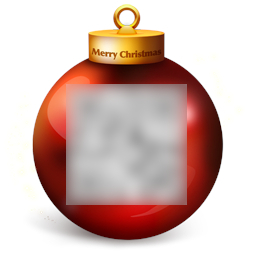

# HV19.01 - Censored

| Author | Level | Categories |
|---|---|---|
| M. | easy | fun |

## Given
I got this little image, but it looks like the best part got censored on the way. Even the tiny preview icon looks clearer than this! Maybe they missed something that would let you restore the original content?

## Approaches

### One
Download the image.
Extract the thumbnail with:
    
    exif -e f182d5f0-1d10-4f0f-a0c1-7cba0981b6da.jpg

The QR code in the resulting thumbnail image was readable via ZXing.

### Two
I had the pleasure to discover CyberChef (https://gchq.github.io/CyberChef) now supports extracting files. 

With that "build step", the readable thumbnail image was produced as well.

## Flag
`HV19{just-4-PREview!}`
