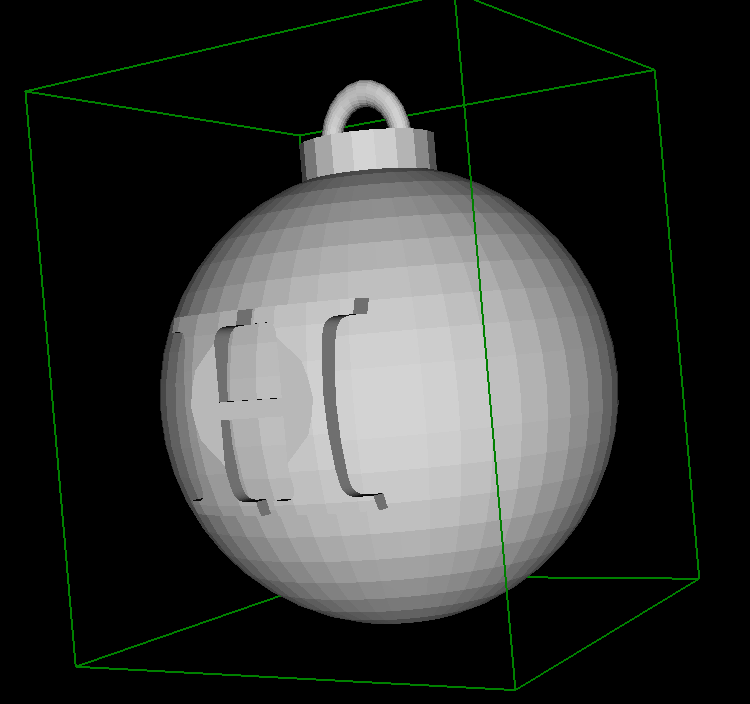
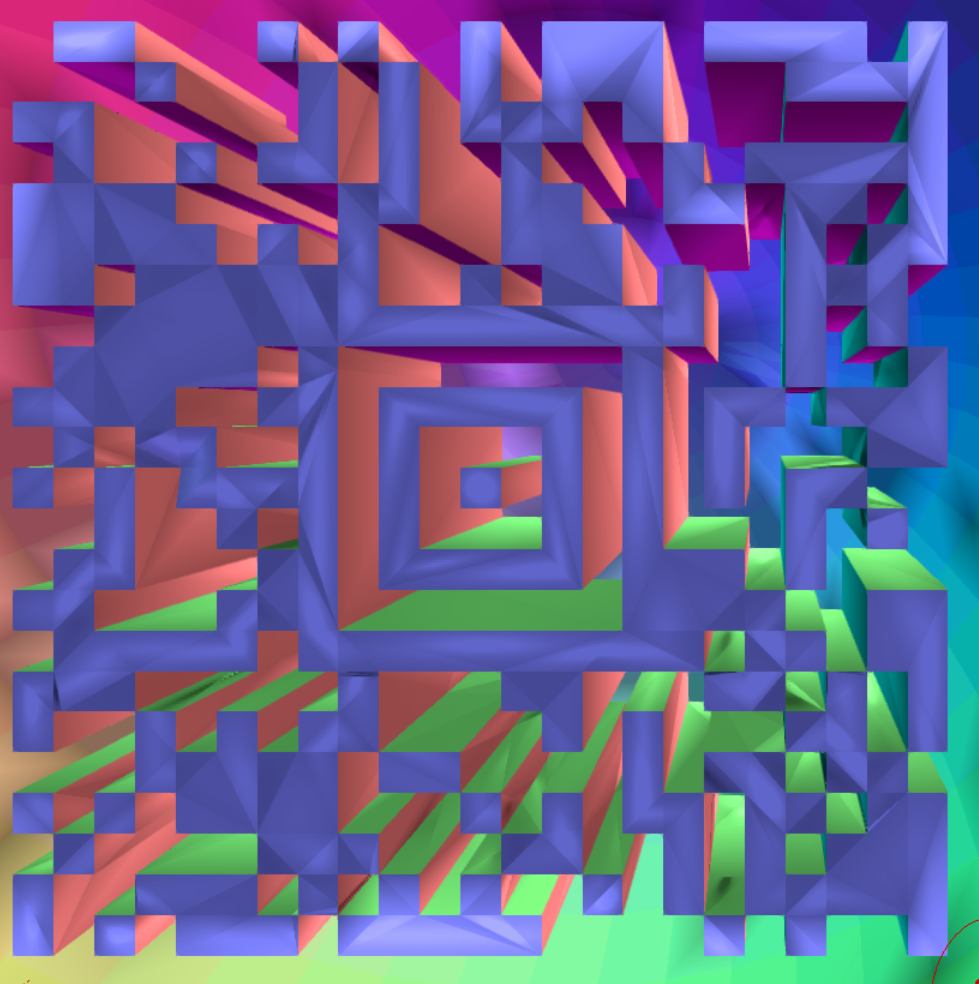

# HV19.02 - Triangulation

| Author | Level | Categories |
|---|---|---|
| DrSchottky | easy | fun |

## Given
Today we give away decorations for your Christmas tree. But be careful and do not break it.

File: [Triangulation](a5f47ab8-f151-4741-b061-d2ab331bf641.zip)

## Approach
Unzipping produces an STL (Standard Triangle Language) file.

I was able to look at the file first using view3dscene (a local software) and https://stephaneginier.com/sculptgl/.

The first impression was a 3D Hackvent christmas ball. Since these christmas balls usually are empty, I tried to zoom in quite quickly. 
Inside, a 3D Aztec code could be found. 

And then the actual time consuming part began...

Eventually, using the online tool, I was able to zoom in, so that I could see the entirety of the code with a resonable contrast. With ZXing not being able to decode, I stopped (to catch a train). On the way, 
I realized it was a 3D(!) code, which could be looked at from behind. 
Once the image was flipped, ZXing was happy and produced the flag.

## Flag
`HV19{Cr4ck_Th3_B411!}`
