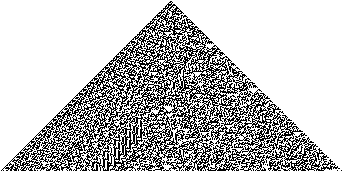
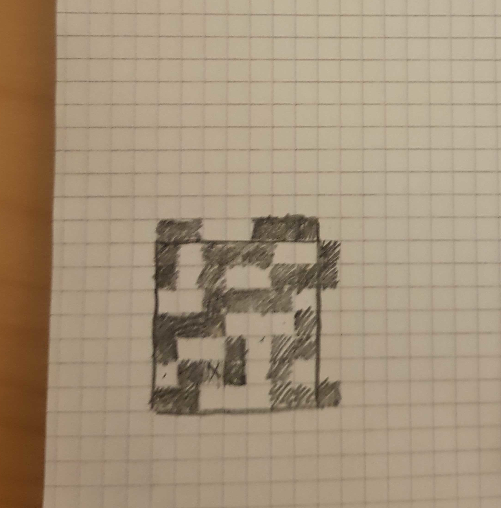
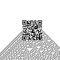

# HV19.09 - Santas Quick Response 3.0

| Author | Level | Categories |
|---|---|---|
| brp64 feat. M. | medium | fun |

## Given

Visiting the following railway station has left lasting memories.

Santas brand new gifts distribution system is heavily inspired by it. Here is your personal gift, can you extract the destination path of it?

### Hints
- it starts with a single pixel
- centering is hard

## Approach

Google Image search quickly led to a Wikipedia page about [Rule 30](https://en.wikipedia.org/wiki/Rule_30). The remaining question was, how to "apply" Rule 30 to fix the broken QR code?

I tried a lot of things...

### Failed

Run rule 30 over the wrong QR code, line by line. And hereby, I mean "apply" Rule 30 to QR code pixels. 

*Retrospectively: Yeah, I know... whatever..*

Another thought I had was that mabe Rule 30 was already applied and we'd have to reverse it? This also led to a "cul-de-sac".

Another failed attempt was to AND/OR/XOR a Rule 30 image, with its peak in the (horizontal and vertical) center of the QR code.

### How I did it

Finally, I manually computed with XOR the needed pattern to re-establish the lower right target on the QR code: 

This seemed like a pattern that's present in the Rule 30 image. So I laid one image over another and XORed them to find the resulting image.

Did I mention that I went down multiple rabbit holes that day? That's also why I did this programatically in Python...

### How it could have been done

After solving, I thought about how it could have been done more easily.

- Open Santa's QR code in GIMP
- Overlay Rule 30 with 50% of transparency.
- Everything that's black or white becomes white, everything that's grey becomes black (graphical XOR)

## Flag
`HV19{Cha0tic_yet-0rdered}`
