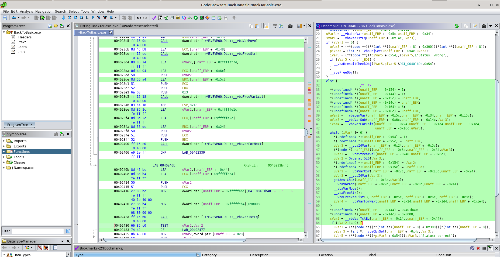
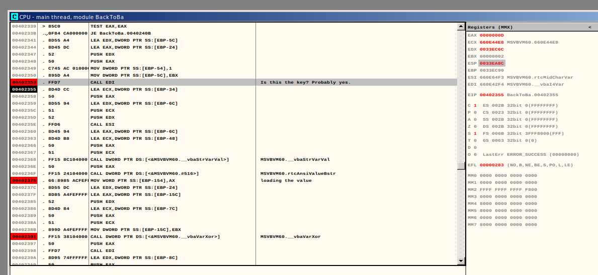

# HV19.12 - back to basic

| Author | Level | Categories |
|---|---|---|
| hardlock | medium | fun; reverse engineering |

## Given
Santa used his time machine to get a present from the past. get your rusty tools out of your cellar and solve this one!

[HV19.12-BackToBasic.zip](67e6c6c2-1119-4c1e-a9b5-85f118173a40.zip)

## Approach

"Rusty tools"? In my case, they were never shiny or even existing. But anyways...

Being a beginner in reverse eingineering I decided to proceed with Ghidra and OllyDbg side by side, as it was clear that we deal with a Windows PE binary and Ghidra provided a decompiled view, which is handy.

Let's have a look at the program. Apparently, the UI will display "Status: wrong" as long as we don't enter the correct flag.

It turns out, the program rejects all strings that do not start with "HV19" and have a length other than 33 characters. Since a flag must include the string "HV19{}", we know that there are 27 variable characters.

Looking at what Ghidra was able to decompile, one can see there's a suspicious looking XOR function somewhere in the middle of the part that we end up in, when a random flag with 33 characters is entered.



In OllyDbg, I then tried to observe what happened right before and after that XOR by setting breakpoints and investigating memory. For example, setting the variable part of a flag to `AAAAAAAAAAAAAAAAAAAAAAAAAAA`, it got encrypted to `GFIHKJMLONQPSRUTWVYX[Z]\_^a`. Computing the encryption key was already possible from this information. However, I also tried to find where this key was loaded with OllyDbg.



It's at address `0x00402358` I was able to observe the secret being loaded for XORing (`PUSH EAX`). Right after that, the corresponding character from the user-entered string is prepared for XORing. The encryption key is:

`06 07 08 09 0a 0b 0c 0d 0e 0f 10 11 12 13 14 15 16 17 18 19 1a 1b 1c 1d 1e 1f 20`

Finally, the program compared the computed string with an encrypted string that can be found at address `0x00401b40`. This is the encrypted flag that gets loaded at `0x00402416`. The encrypted flag is:

`6klzic<=bPBtdvff'y.FI~on//N`

Or in hex values:

`36 6b 6c 7a 69 63 3c 3d 62 50 42 74 64 76 66 66 27 79 7f 46 49 7e 6f 6e 2f 2f 4e`

As XOR is revertible, we can now apply this operation again to find the flag:

`30 6c 64 73 63 68 30 30 6c 5f 52 65 76 65 72 73 31 6e 67 5f 53 65 73 73 31 30 6e`

which, in ASCII, is:

`0ldsch00l_Revers1ng_Sess10n`

Nice.

## Credits
- Thanks to *mcia* for helping me through this reversing challenge and keeping me in front of the screen with tiny, non-revealing but very teasing hints. Reversing, for me, was/is a pretty new thing in which I'm still building up some experience.

## Flag
```
HV19{0ldsch00l_Revers1ng_Sess10n}
```
