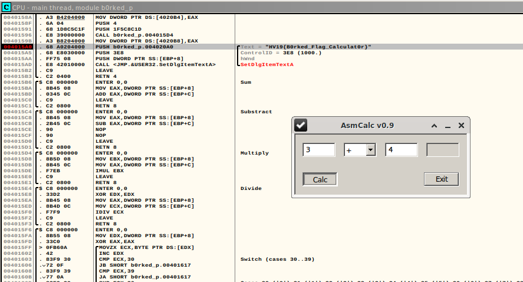

# HV19.16 - B0rked Calculator

| Author | Level | Categories |
|---|---|---|
| hardlock | hard | fun |

## Given

Santa has coded a simple project for you, but sadly he removed all the operations.
But when you restore them it will print the flag!

[HV19.16-b0rked.zip](9b90c573-d530-401b-b3f8-24454bbf015e.zip)

## Approach
First, I started skimming through the binary with Ghidra, only to find these NOP sleds somewhere after address 0x00401000.

I quickly thought that patching the binary was probably easier than analysing it in a static way or even calculating the functions while running a debugger. 

So, I spent some time)to find out how to patch a Windows PE binary file - never done that so far.
OllyDbg was the candidate of choice.

OllyDbg allows one to write assembly code which is assembled on the fly. 

I added the 4 functions in assembly code and "B0rked Calc" produced the flag. 

See the screenshot for details:




## Flag
```
HV19{B0rked_Flag_Calculat0r}
```

## Other notes

Software to edit other software (binary patching):

- Binary patching bsdiff & bspatch
- Hopper
- Manipulate PE file with Python: https://axcheron.github.io/pe-format-manipulation-with-pefile/
