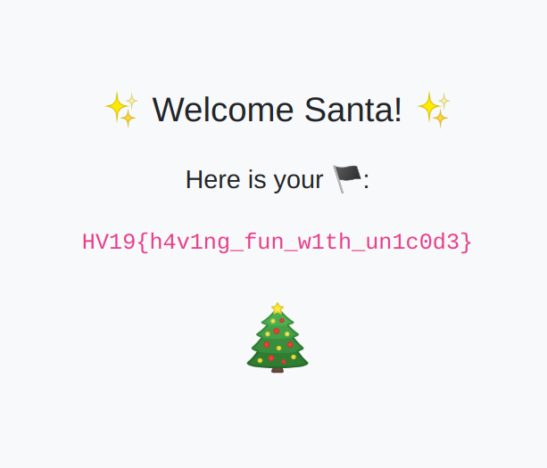

# HV19.17 - Unicode Portal

| Author | Level | Categories |
|---|---|---|
| scryh | hard | fun |

## Given
Buy your special gifts online, but for the ultimative gift you have to become admin.

http://whale.hacking-lab.com:8881/

### Source

After registering with the given portal, one had access to the source code of the page:

```php
<?php

if (isset($_GET['show'])) highlight_file(__FILE__);

/**
 * Verifies user credentials.
 */
function verifyCreds($conn, $username, $password) {
  $usr = $conn->real_escape_string($username);
  $res = $conn->query("SELECT password FROM users WHERE username='".$usr."'");
  $row = $res->fetch_assoc();
  if ($row) {
    if (password_verify($password, $row['password'])) return true;
    else addFailedLoginAttempt($conn, $_SERVER['REMOTE_ADDR']);
  }
  return false;
}

/**
 * Determines if the given user is admin.
 */
function isAdmin($username) {
  return ($username === 'santa');
}

/**
 * Determines if the given username is already taken.
 */
function isUsernameAvailable($conn, $username) {
  $usr = $conn->real_escape_string($username);
  $res = $conn->query("SELECT COUNT(*) AS cnt FROM users WHERE LOWER(username) = BINARY LOWER('".$usr."')");
  $row = $res->fetch_assoc();
  return (int)$row['cnt'] === 0;
}

/**
 * Registers a new user.
 */
function registerUser($conn, $username, $password) {
  $usr = $conn->real_escape_string($username);
  $pwd = password_hash($password, PASSWORD_DEFAULT);
  $conn->query("INSERT INTO users (username, password) VALUES (UPPER('".$usr."'),'".$pwd."') ON DUPLICATE KEY UPDATE password='".$pwd."'");
}

/**
 * Adds a failed login attempt for the given ip address. An ip address gets blacklisted for 15 minutes if there are more than 3 failed login attempts.
 */
function addFailedLoginAttempt($conn, $ip) {
  $ip = $conn->real_escape_string($ip);
  $conn->query("INSERT INTO fails (ip) VALUES ('".$ip."')");
}

?>
```

## Approach
From the given source code it was clear that we had to become "santa" (which is re-named "admin"). My first focus was on the `real_escape_string` function, but despite being not very restrictive, it didn't leverage an SQL injection. 

Second, I noticed these strange upper-/lowercase transformations, which seemed odd. Let's try to go after them. The challenge's name was about "unicode", so let's have a loo kat the intrsection of SQLi and Unicode. 

After some research (https://bugs.mysql.com/bug.php?id=19567) on MySQL vulnerabilities, it became clear that case transforms are not done correctly. An "ä", if transformed to uppercase, becomes an "A" (just like a regular "a"). Another variant would have been to use `ſ` which becomes `S` when transformed to uppercase. The following link lists qute some of these unicode collisions: https://eng.getwisdom.io/awesome-unicode/

With that, we could create a user "säntä", and with that update the "santa" user's password, which lets one log in with the newly set password and get the fläg.



Fun fact: On that same day, there was an article on the HackerNews frontpage about ["Hacking GitHub"](https://eng.getwisdom.io/hacking-github-with-unicode-dotless-i/) with unicode characters. Turns out, copy&pasting from that article the charcter "ſ" (which becomes an "S" if turned into upper case) solved that day's challenge, too. Feel free, if you want to participate in the [discussion](https://news.ycombinator.com/item?id=21809390).


## Fläg
```
HV19{h4v1ng_fun_w1th_un1c0d3}
```
