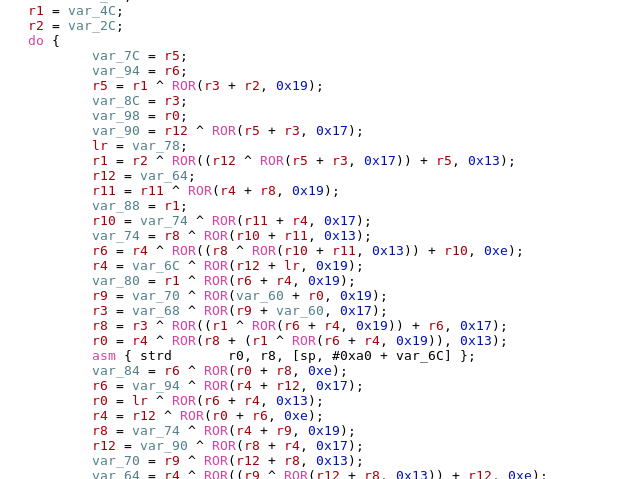

# HV19.18 - Dance with me

| Author | Level | Categories |
|---|---|---|
| hardlock | hard | fun; crypto; reverse engineering |

## Given

Santa had some fun and created todays present with a special dance. this is what he made up for you:
```
096CD446EBC8E04D2FDE299BE44F322863F7A37C18763554EEE4C99C3FAD15
```
Dance with him to recover the flag.

[HV19-dance.zip](93d0df60-3579-4672-8efc-f32327d3643f.zip)

## Approach

After unzipping, a file named `dance` was presented. This file apparently was a Debian package:

```bash
$ dpkg --contents dance
drwxr-xr-x root/wheel        0 2019-12-14 13:52 .
drwxr-xr-x root/wheel        0 2019-12-14 13:52 ./usr
drwxr-xr-x root/wheel        0 2019-12-14 13:52 usr/bin
-rwxr-xr-x root/wheel   197728 2019-12-14 13:52 usr/bin/dance
```

Once unpacked (with `dpkg-deb -x`), an ARMv7 executable was written to disk:

```bash
$ file dance 
dance: Mach-O universal binary with 3 architectures: [armv7:Mach-O armv7 executable, flags:<NOUNDEFS|DYLDLINK|TWOLEVEL|PIE>] [arm64:Mach-O 64-bit arm64 executable, flags:<NOUNDEFS|DYLDLINK|TWOLEVEL|PIE>] [arm64:Mach-O 64-bit arm64 executable, flags:<NOUNDEFS|DYLDLINK|TWOLEVEL|PIE>]
```

Meanwhile, the challenge author provided the following iPhone screenshot along with the hint: "*just a big hint maybe: dance is nothing home made. its a public algorithm and when you understood that, it should be rather easy*"


In parallel, with *mcia* we brainstormed some "dance-y" ciphers. We came up with [Salsa20](https://en.wikipedia.org/wiki/Salsa20), ChaCha20, Rumba20, etc.

In the decompiled version of the binary (pay attention to the architecture, it's 64-bit), somewhere in the `__dance_words` function, bits were shifted to the right by 0x19, 0x17 and 0x13 positions. On a word value, which is 32 bit wide (the value of a register), this corresponds to bit shifts to the left by 0x7, 0x9 and 0xD poistions, which is exactly what Salsa20 does.



So, let's assume it's Salsa20. With this assumption, we can go back to the main method and find out about the nonce and the secret being used.


Finding the nonce is pretty straight forward. There is an immediate value (`0xb132d0a8e78f4511`) passed to the `_dance` function.

The secret gets loaded between addresses 0x0100007da4 and 0x0100007dbc. There, a memory location is stored in x8 using an immediate value. After the `nop` instruction, two quad-word registers (2 \* 4 \* 32 bit = 32 bytes) are populated and stored on the stack. This happens a second time without offset, and that's when our secret gets loaded.

Finally, the secret is `0x0320634661b63cafaa76c27eea00b59bfb2f7097214fd04cb257ac2904efee46`.

To solve, I wrote a python solver leveraging [PyCryptodome's Salsa20 implementation](https://pycryptodome.readthedocs.io/en/latest/src/cipher/salsa20.html):

```python
#!/usr/bin/env python

from Cryptodome.Cipher import Salsa20
import base64

nonce = base64.b16decode(b'11458fe7a8d032b1', casefold=True)
secret = base64.b16decode(b'0320634661b63cafaa76c27eea00b59bfb2f7097214fd04cb257ac2904efee46', casefold=True)

# Confirm the hint; needs to print the cleartext again
cipher = Salsa20.new(key=secret, nonce=nonce)
test_cleartext = b"fakeflagfakeflag"
test_ciphertext = base64.b16decode(b'275b8e1af6e0e0442a8e2c99dd7032231a', casefold=True)
print(cipher.decrypt(test_ciphertext))

ciphertext = base64.b16decode(b'096CD446EBC8E04D2FDE299BE44F322863F7A37C18763554EEE4C99C3FAD15', casefold=True)
cipher = Salsa20.new(key=secret, nonce=nonce)
print(str(cipher.decrypt(ciphertext)))
# Prints the flag: HV19{Danc1ng_Salsa_in_ass3mbly}
```

For going through the assembly, http://infocenter.arm.com/help/index.jsp was a good resource to understand what's going on. 

Also, it was crucial to configure the right architecture (`AArch64`) to be used by the disassembler.

## Flag 
```
HV19{Danc1ng_Salsa_in_ass3mbly}
```
