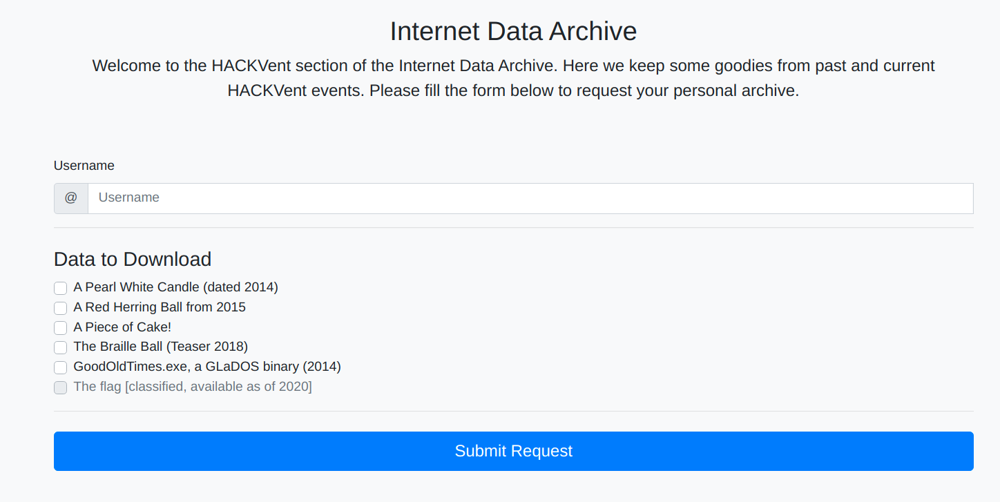

# HV19.23 - IDA PRO

| Author | Level | Categories |
|---|---|---|
| M. | leet | fun |

## Given
Today's flag is available in the Internet Data Archive (IDA).

http://whale.hacking-lab.com:23023/

## Approach
The Internet Data Archive allows to download Hackvent challenges from previous years. Every zip that is downloaded is encrypted with a different password. 



After trying out the service, I noticed that username `santa` made the zip generation break.

I therefore checked, where zips are downloaded from. It turns out, archives were downloaded from http://whale.hacking-lab.com:23023/tmp/, which was even configured as an indexed directory. 

Sorting by timestamp uncovered the aldest of all zip files: [`Santa-data.zip`](Santa-data.zip). And also a `phpinfo.php` file - yay!

Knowing that a new password was generated every time a zip was requested, it was probable, that we had to analyse passwords to be able to come to conclusions about how Santa's file was encrypted.

One thing to note is, that zip-files were encrypted with AES-128, which is what 7zip uses by default, I think,

Here are a couple of passwords: 
```
pA5XVaDjsXuU
W6WtwyyVaHvg
kVevKfXHpJyb
PSaZpTVYPPBH
qdCym8cq97Zf
UVuQDbKHEuvv
LZzKrb7dkW2c
mw7YCuEL4r6q
wUWVSQQ8B9hk
BhcwkmsGrKyk
PBUXS9MJqi2C
m9FwV4kVdARQ
WyDd4zhZYRJ4
BPhQDDcUJVX6
Sc8gYjTFzha8
qkSxA3dxMv6f
UBPLhRYVAWEQ
8tLFFaRi3XTf
Ep3d6yZGDKgb
FxvvJpavwSvr
vbMDrBfFKjUE
A3Y8f4Yvcwyz
Hzx8WzXuaf4F
YVdaxXwJSkFs
DECzwgapPE6q
645t8TE2H7pX
Yypyb5weMLZq
DfbgWggFYA3R
```

Analysing this resulted in the following alphabet used for passwords: 
`23456789ABCDEFGHJKLMPQRSTUVWXYZabcdefghijkmpqrstuvwxyz`

It's not super-obvious, but characters 0, 1, I, N, O, l (lowercase L), n, and o are missing.

Fast-forwarding over multiple hours of confusion: There was a hint on Discord, that the title of the challenge had an important role here. So a DuckDuckGo (or was it the other one?) search for `IDA-PRO 23456789ABCDEFGHJKLMPQRSTUVWXYZabcdefghijkmpqrstuvwxyz` led to https://devco.re/blog/2019/06/21/operation-crack-hacking-IDA-Pro-installer-PRNG-from-an-unusual-way-en/. In that article, the same password format as in our challenge could be found. A strong indicator that we're on the right path. There, a team described how they broke IDA Pro's Pseudo Random Number Generator (PRNG) with brute force by trying out multiple programming languages and iterating over seeds.

In contrast to that team, we already knew about the programming language used and, thanks to phpinfo, even what version of PHP is generating passwords (7.4.1) and the PRNG in use ("Mersenne Twister"). 

Another thing to note is, that PHP's `srand(seed)` function casts down all seeds to a size 32 bit, so it's pointless to go beyond PHP's PHP_INT_MAX value.

So all that remains to do, is to find the [right seed](https://www.php.net/manual/en/function.srand.php) for the PRNG. 

To do so, I created a PHP script seeding the PRNG and generating one random number (with all 6 possible alphabets):

```php
<?php

$alphabets = array(
	0 => "abcdefghijkmpqrstuvwxyzABCDEFGHJKLMPQRSTUVWXYZ23456789",
	1 => "abcdefghijkmpqrstuvwxyz23456789ABCDEFGHJKLMPQRSTUVWXYZ",
	2 => "23456789ABCDEFGHJKLMPQRSTUVWXYZabcdefghijkmpqrstuvwxyz",
	3 => "23456789abcdefghijkmpqrstuvwxyzABCDEFGHJKLMPQRSTUVWXYZ",
	4 => "ABCDEFGHJKLMPQRSTUVWXYZabcdefghijkmpqrstuvwxyz23456789",
	5 => "ABCDEFGHJKLMPQRSTUVWXYZ23456789abcdefghijkmpqrstuvwxyz"
);

function generateString($seed, $alphabet)
{
	srand($seed);

	$pwd = "";
	for ($j=0; $j < 12; $j++) { 
		$val = rand(0,strlen($alphabet)-1);
		$pwd .= $alphabet[$val];
	}
	
	fwrite(STDERR, "" . $seed . " " . $alphabet . " " . $pwd . "\n");
	print($pwd);
	print("\n")
}

$start = 0;
for ($i=$start; $i < PHP_INT_MAX; $i++) { 

	fwrite(STDERR, "$i\n");
	for ($a=0; $a < sizeof($alphabets); $a++) { 

		generateString($i, $alphabets[$a]);
	}
}

?>
```

This script was then combined with John the Ripper, the zip password cracking tool:

```bash
zip2john -o flag.txt Santa-data.zip > flag.txt.passwd.txt
php solver.php 2>seeds2 | john --stdin flag.txt.passwd.txt
```

With this, I was able to find that the used seed was `4333287`, the right alphabet was `abcdefghijkmpqrstuvwxyzABCDEFGHJKLMPQRSTUVWXYZ23456789` and the encryption password was `Kwmq3Sqmc5sA`.

With that, we could unzip the file and read the contents of `flag.txt`.

## Credits
Credits go once more to *mcia*. He cross-checked my script (after he found the flag, obviously) and sent me a link that allowed me to discover, that in PHP `rand() % 54` is not the same as `rand(0, 54)` \*facepalm\*.


## Flag
```
HV19{Cr4ckin_Passw0rdz_like_IDA_Pr0}
```
