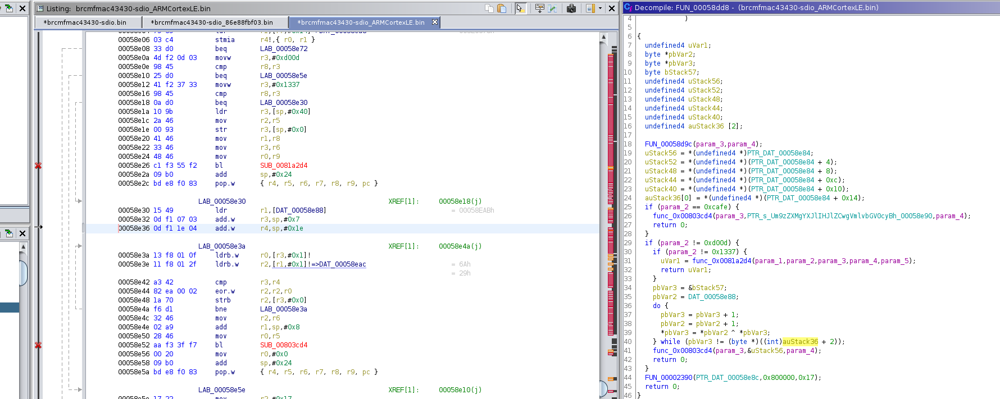

# HV19.24 - Ham Radio

| Author | Level | Categories |
|---|---|---|
| DrSchottky | leet | fun; reverse engineering |

## Given
Elves built for santa a special radio to help him coordinating today's presents delivery.

Resources: [HV19-ham radio.zip](19bf7592-f3ee-474c-bf82-233f270bbf70.zip)


## Approach

Disclaimer: Actions described hereafter happened, but not necessarily in this order. This is due to the author's lack of experience in reverse engineering and, hence, the educative approach taken.

DuckDuckGo-ing for the binary's name resulted in many articles about a Broadcom wifi chip. Also, there were many references to Raspberry Pi Model 3. Turns out it's the RAM part of a wifi chip firmware used on some RPi models. Since all attempts to load the binary into a disassembler more or less failed (due to insufficient information on CPU architecture), I checked the architecture of my own RPi.

```
root@raspberrypi:/home/pi# lscpu 
Architecture:        armv7l
Byte Order:          Little Endian
CPU(s):              4
On-line CPU(s) list: 0-3
Thread(s) per core:  1
Core(s) per socket:  4
Socket(s):           1
Vendor ID:           ARM
Model:               4
Model name:          Cortex-A53
Stepping:            r0p4
CPU max MHz:         1200.0000
CPU min MHz:         600.0000
BogoMIPS:            38.40
Flags:               half thumb fastmult vfp edsp neon vfpv3 tls vfpv4 idiva idivt vfpd32 lpae evtstrm crc32
```

Providing the Ghidra disassembler with this information resulted in meaningful assembly code. (Side note: Hopper seemed to produce only garbage in the beginning, but providing a base address and entry point of 0x0 combined with the above architecture information gave better results, equivalent to Ghidra).

`binwalk -Y` (which can be used to identify a binary's target architecture) was not helpful in this case: 
```
$ binwalk -Y brcmfmac43430-sdio.bin 

DECIMAL       HEXADECIMAL     DESCRIPTION
--------------------------------------------------------------------------------
327           0x147           ARM executable code, 16-bit (Thumb), big endian, at least 555 valid instructions
```

Meanwhile, I checked the binary for cleartext strings, which is always a good thing. In the end of file, the following coud be found: 

```
$ strings brcmfmac43430-sdio.bin | tail -n 20
%7`%p
8hyh
8iyi
AF3FHF
2F(F
Um9zZXMgYXJlIHJlZCwgVmlvbGV0cyBhcmUgYmx1ZSwgRHJTY2hvdHRreSBsb3ZlcyBob29raW5nIGlvY3Rscywgd2h5IHNob3VsZG4ndCB5b3U/
pGnexmon_ver: 2.2.2-269-g4921d-dirty-16
wl%d: Broadcom BCM%s 802.11 Wireless Controller %s
DehW
kDej
DehKT
kDehv
kDeh
kDehv
-R#7
+./1y
-).T
[#EKIG(
43430a1-roml/sdio-g-p2p-pool-pno-pktfilter-keepalive-aoe-mchan-tdls-proptxstatus-ampduhostreorder-lpc-sr-bcmcps Version: 7.45.41.46 (r666254 CY) CRC: 970a33e2 Date: Mon 2017-08-07 00:48:36 PDT Ucode Ver: 1043.206
FWID 01-ef6eb4d3
```

The interesting parts are: 
- `Um9zZ...`: An unusually long cleartext string; turns out **it's base64** and encodes the following marvelous poem: "Roses are red, Violets are blue, DrSchottky loves hooking ioctls, why shouldn't you?"
- `...nexmon_ver: 2.2.2...`: [Nexmon](https://github.com/seemoo-lab/nexmon) is a **firmware patching framework** to which, oh surprise, the challenge author DrSchottky [contributes](https://github.com/seemoo-lab/nexmon/graphs/contributors). mcia confirmed, that this was most probably the right track.

Another thing I did then was looking up the original firmware, as the one provided has obviously been patched. I found an original firmware at https://github.com/RPi-Distro/firmware-nonfree/tree/master/brcm.

Back to Ghidra.

Loading in both firmwares and diffing them (which is something that comes with Ghidra) showed, that the base64 string **was referenced** by a function (`FUN_00058dd8`), that's been added by DrSchottky. The function looks as follows. Let's follow up on that.



Looking at the decompiled C representation of that function, its XOR operation is striking. It XORs some stack values (`SP+0x8`) with some data values (pointed to by `0x00058e88`, resulting in `0x00058eab`). 

At the indicated stack address we have the following values: 
`09 bc 31 3a 68 1a ab 72 47 86 7e e6 4a 1d 6f 04 2e 74 50 0d 78 06 3e 00`

The *initial* data values are (I removed the leading `00` as it's skipped right away): 
`29 6a 91 44 3b be 27 15 92 07 c9 f3 47 77 ed e5 26 10 76 74 80 57 1f 00`

XORing this results in some gibberish. Doh... However, that gibberish gets processed further by some function `func_0x00803cd4` which is not part of this binary. There's more! Somewhere...

Reading up about how this firmware behaves and what else it could address, I stumbled over the following text, which suggests that the chip's ROM part starts at address 0x800000: https://github.com/seemoo-lab/nexmon/#dumping-the-rom-directly.

So, let's get that ROM, then. That's easier said than done. Hours later, and thanks to logical overflow and bread, I found it: https://github.com/seemoo-lab/bcm_misc/blob/master/bcm43430a1/rom.bin. Close enough - let's see whether it makes sense. Loading into Ghidra at base address 0x800000 made it meaningful.

It turns out, `func_0x00803cd4` is some sort of *strcpy* function, copying n bytes (`param_3`) from a memory location (`param_2`) to another (`param_1`). Not much new for our challenge, then.

Ok, let's look at what happens if we proceed in a smarter way. Let's consider the branches which test for `0xcafe`, `0xd00d` and `0x1337` (which seem suspicious, given these oddly specific and CTF-like values). 

If `param_2` takes the value `0xcafe`, the base64 string is copied to the address indicated by `param_3` and returns. If it takes `0x1337`, we go down the XOR path. What if it takes `0xd00d`?

If `param_2` takes `0xd00d`, `FUN_00002390` is called, which is in the initial (unpatched) binary. Some closer analysis indicated, that it is referenced quite often and it seems to be some sort of efficient *memcpy* copying n bytes (`param_3`) from one memory location (`param_2`) to another (`param_1`).

Looking at the parameters given to `FUN_00002390`, it seems that we copy `0x17` bytes from `0x800000` to `0x00058eac` (which `0x00058e8c` points to).

Let's digest this (it took me quite a while): The program copies bytes from the beginning of the ROM and places them to the location used for XORing. If that's not a milestone!?

The first `0x17` bytes of the ROM are: 
`41 ea 00 03 13 43 9b 07 30 b5 10 d1 0c 68 03 68 63 40 13 60 4c 68 43`

XORed with the value on the stack, this gives:
`48 56 31 39 7b 59 30 75 77 33 6e 37 46 75 6c 6c 4d 34 43 6d 34 6e 7d`

...which is our **flag**!

So, to summarize, the analysed function has to be called twice. Once with a value of `0xd00d` to initialize data and a second time with a value of `0x1337` to do the XOR and get the flag.


### Distractors

As described, I took the diff between the patched firmware and the original one. Turns out, this was more a disctractor than a help. With differing sections being highlighted, I decided to have a look at them at some point. That was the start of a veeery deep rabbit hole.

0xcc managed to pull me out of that rabbit hole a couple of hours before the challenge's deadline for full points.

In the process of solving this challenge, I also learned a lot about [ARM architectures](https://www.blackhat.com/presentations/bh-europe-04/bh-eu-04-dehaas/bh-eu-04-dehaas.pdf) and binaries, which can be in ARM mode (32 bit), thumb mode (16 bit) etc. This link also made me discover `disarm`.

I also discovered that there's much more about firmware reversing to be learned. Another link to keep is https://blog.quarkslab.com/reverse-engineering-broadcom-wireless-chipsets.html.

In addition to what was needed for the flag, I reversed the remaining function call `FUN_00058d9c`, which seems to initialize a data stucture, but was not helpful beyond that.

I also went into `FUN_000455f8`, `FUN_000567f0`, `FUN_00055f9c` (!!!) and `FUN_00055e54`, all of which was just wasted time (and excercise).


## Credits
- *mcia* for moral support (and bringing me back in front of the screen when I already gave up).
- *0xcc* for bringing me back on the right path.
- *logical overflow* and *bread* for giving me a pointer, when I already started extracting a ROM after multiple hours of unsuccessful googling.


## Flag
```
HV19{Y0uw3n7FullM4Cm4n}
```
